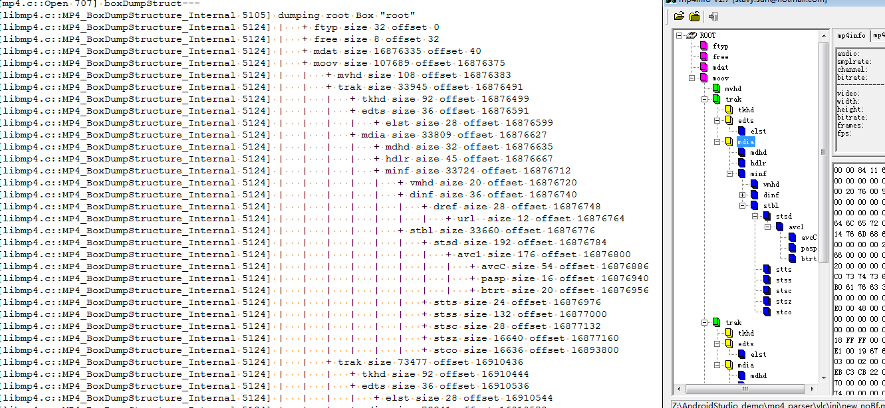

# mp4_demux_mux
some mp4 demux/mux modules for learning，Extracted from vlc source 、Android mediaExtractor and FFmpeg

vlc:
	from vlc 3.0.11 source code 
        vlc 子目录下面，是从vlc3.0.11 源码中抽取出来的mp4解析部分代码，单独编译成了一个库和一个可执行文件，test_demux.c 

